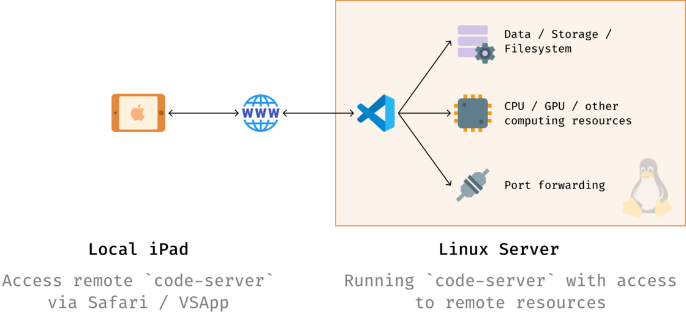

# vscode-web-docker

> docker 一键部署 vscode-web ：使用浏览器远程开发

------

## 简介

通常情况下的远程开发，是把代码放在远程服务器，然后在本地的 [vscode](https://code.visualstudio.com/) 通过 SSH 登录到该服务器进行开发。

但是对于无法安装 [vscode](https://code.visualstudio.com/) 的设备（如 iPad）则无法这样做。

为了解决这个问题，可以把 [vscode](https://github.com/cdr/code-server) 也安装到远程服务器，并提供可以访问该 [vscode](https://github.com/cdr/code-server) 的 web 服务接口，那么在任意设备均可以通过浏览器实现远程开发了。


[code-server](https://github.com/cdr/code-server) 就是可以安装在远程服务器并提供 web 服务的 vscode。

本仓库只是对 [code-server](https://github.com/cdr/code-server) 的 [Docker](https://hub.docker.com/r/linuxserver/code-server) 镜像的简单封装。

> 参考文档《[为 iPad 部署基于 VS Code 的远程开发环境](https://sspai.com/post/60456)》



## 目录结构说明

```
vscode-web-docker
├── README.md
├── imgs
├── docker-compose.yml
├── run.sh
├── stop.sh
└── vscode
    ├── config
    │   └── .config
    │       ├── code-server
    │       │   └── config.yaml
    │       └── User
    │           └── settings.json
    ├── Dockerfile
    └── workspace
```


## 项目构建

- 宿主机安装 docker、docker-compose
- 宿主机安全组/防火墙（iptables/firewall）放行 8443 端口的入口流量
- 下载仓库： `git clone https://github.com/lyy289065406/vscode-web-docker`
- 构建镜像并运行： `./run.sh -p basicauth_password`

> basicauth_password 是通过浏览器访问 vscode 的密码


## 远程访问

用浏览器访问 http://${server-ip}:8443 即可（访问的是容器内的内容）

但直接用 iPad 的 Safari 浏览器访问 [code-server](https://github.com/cdr/code-server) 的体验还是比较糟糕，上面地址栏和下面外接键盘出现的菜单栏都非常不顺畅，因此最好使用 [VSApp](https://sspai.com/app/VSApp%20-%20code-server) 作为 ipad 的本地客户端去访问 [code-server](https://github.com/cdr/code-server)。

[VSApp](https://sspai.com/app/VSApp%20-%20code-server) 是一款专门为 iPad 用来优化 [code-server](https://github.com/cdr/code-server) 连接的 iOS 原生应用： 启动 APP 后，在【Self Hosted Server】填写 [code-server](https://github.com/cdr/code-server) 的连接信息即可。
